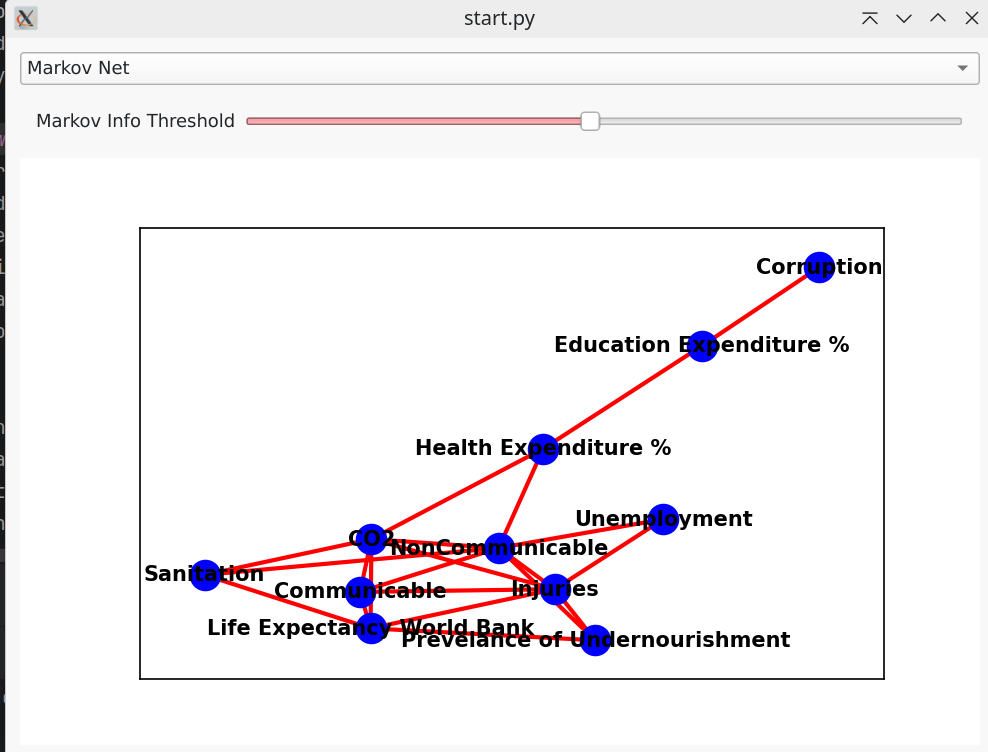
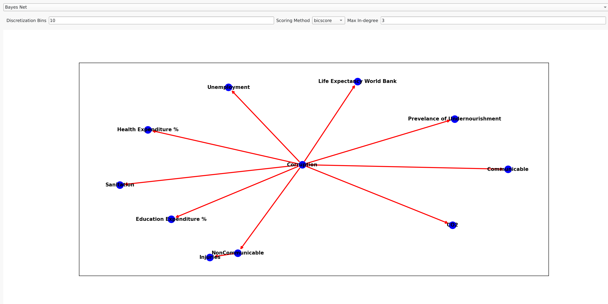

This is a demo project for the purpose of showing my skills for a potential employer. 
It doesn't bring any added value to the real world, merely showcases my abilities by using
a simple and entertaining example. 
I'm also employing a relatively new statistical method to an old problem of finding causal relationships - 
**Mutual Information**.

## Technologies used:
- Python 3
- Pyside
- numpy, pandas, scipy etc.

## Knowledge demonstrated:
- Programming skills
- GUI development
- Mathematics
- Statistics
- Probabilistic Graphical Models
- Common sense

## How to run:
1. Clone the repository 
2. Create a virtual environment and activate it
3. Install the requirements by running `pip install -r requirements.txt`
4. python main.py ../data/life_expectancy.csv

## What We Do:
When we run the application with the life_expectancy.csv, we are loading the world bank data
on various parameters collected for different countries - effectively just a big data table.
We are trying to reconstruct the casual relationships between the parameters.

We are doing this by employing probabilistic graphical models (PGM), which exist in 2 main flavors:
- Markov Networks (undirected graphs)
- Bayesian Networks (directed graphs)

First, we are trying to reconstruct the Markov Network

Our markov network is essentially a correlation matrix, the parameter "Markov Info threshold" 
is an absolute value of linear correlation between 2 parameters, above which we consider them to be connected.
That's basically a classical statistical approach to the problem. 
Some problems with this approach are immediately seen from the graph:
- There are no causal relationships, it's just a mess (Statistics 101: "correlation is not causation")
- (More technical) Correlation always means _linear_ correlation, and we might miss some non-linear relationships

Now, let's try the Bayesian Network

There are 10 horsemen of the apocalypse, but only one behind all of them - **Corruption**.
How are we able to get this result? 

First, we calculate a measure called **Mutual Information** between all pairs of parameters.
There are different algorithms, and you can choose from the dropdown menu "Scoring method" which one to use,
but the idea is basically as follows: how much knowing the value of one parameter can help us predict the value of the other.

Secondly, to find the casual direction, we are using the common sense knowledge: 
it's more likely that one thing causes many others, than many things causing one.
Here, you see the parameter "Max-in-degree", which is the maximum number of parents a node can have - basically, how many parameters this one can cause.

The latter algorithm (Bayessian Network) is more complex and computationally expensive compared to the Correlation Matrix of Markov Networks -
a computation, that can be performed with a pen and paper. For Bayesian Networks, we are using the library pgmpy, which is a Python library for working with PGMs,
and provides a variety of algorithms for learning the structure of the network from the data. 

Literature:
- Koller, Daphne, and Nir Friedman. Probabilistic graphical models: principles and techniques. MIT press, 2009.
- Pearl, Judea. The book of why: The new science of cause and effect. Basic Books, 2018.
- Murphy, Kevin P. Probabilistic machine learning: an introduction. MIT press, 2022.

